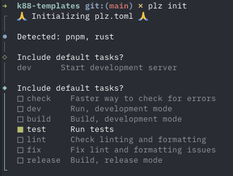

# plzplz

```bash
cargo install plzplz
```

A simple cross-platform task runner with helpful defaults. Tasks are stored
in a `plz.toml` and run with `plz [task]`



For the following example, `plz format` would run `cargo fmt --check`, and then
suggest `cargo fmt` if it fails:

```toml
# Check formatting
[tasks.format]
run = "cargo fmt --check"
fail_hook = { suggest_command = "cargo fmt" }
```

## Add plz to a project

In a rust, uv, or pnpm repo run this to initialize a new `plz.toml`:

```bash
plz init
```

To add a new task, you can run:

```bash
plz add [task]
```

## Default files

If you run

```bash
plz plz
```

plzplz will create files in in ~/.plz that you can add your own default tasks
to for different environments.

## TOML Reference

### Basic task

```toml
[tasks.build]
run = "cargo build"
```

### Run commands in parallel or serial

```toml
[tasks.check]
run_parallel = ["plz lint", "plz format"]

[tasks.fix]
run_serial = ["cargo fmt", "cargo clippy --fix --allow-dirty"]
```

### Working directory

```toml
[tasks.frontend]
dir = "packages/web"
run = "pnpm dev"
```

### Failure hooks

On failure, suggest a command for the user to run:

```toml
[tasks.check]
run_parallel = ["plz lint", "plz format"]
fail_hook = { suggest_command = "plz fix" }
```

Display a message on failure:

```toml
[tasks.deploy]
run = "deploy.sh"
fail_hook = { message = "Check the deploy logs at /var/log/deploy.log" }
```

Run a shell command on failure:

```toml
[tasks.test]
run = "cargo test"
fail_hook = "notify-send 'Tests failed'"
```
