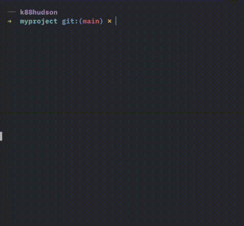

## Install

::: code-group

```cargo
cargo install plzplz
```

```bash [macOS / Linux]
curl --proto '=https' --tlsv1.2 -LsSf https://plzplz.org/install.sh | sh
```

:::

## Quick Example

{width=450px}

```toml
# Check formatting
[tasks.format]
run = "cargo fmt --check"
fail_hook = { suggest_command = "cargo fmt" }
git_hook = "pre-commit"
```

```bash
plz format
```

## Features

- **Auto-detect environments** — `plz init` detects Rust, pnpm, npm, uv and suggests tasks
- **Serial & parallel execution** — `run_serial` and `run_parallel` for composing tasks
- **Failure hooks** — suggest commands, show messages, or run scripts on failure
- **Task groups** — organize related tasks with `[taskgroup.X]` namespaces
- **Git hooks** — configure hooks directly in plz.toml
- **Environment wrappers** — run commands through pnpm, npm, uv, or uvx with `tool_env`
- **Interactive selection** — fuzzy-find tasks when you forget the name
